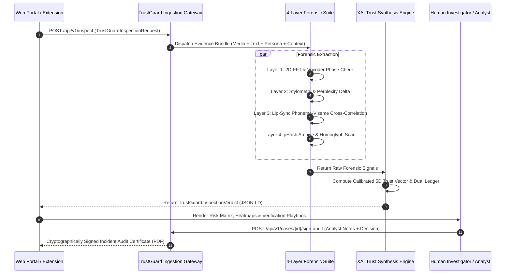

# TrustGuard OpenSpec: Technical Specification & Data Contracts
**Standard: TrustGuard Core v1.0.0 · PS-02 Digital Trust Pipeline**

> **Implemented runtime amendment (2026-09-25):** The original design examples below describe ambitions, not measured authenticity probabilities. The runtime uses bounded heuristic indices and an explicit unavailable-dimension ledger. It never emits automatic `VERIFIED_AUTHENTIC`, `LOW_RISK_VERIFIED` or `BENIGN_AUTHENTIC` decisions. The inspection endpoint requires two actually evaluated modalities; URL strings, silent audio and empty/constant frames cannot satisfy this requirement. There is no biometric enrollment or persistent embedding vault. See [README.md](README.md) for the executable scope and launch instructions.

### Runtime contract additions

- `evidenceItems[].samples` carries bounded transient grayscale pixels, mono PCM samples, optional reference pixels, synchronized audio-envelope/mouth-aperture traces, measured room impulse responses or facial-ROI mean RGB traces. The backend never fetches `mediaUri` or `avatarUrl`. Pydantic rejects malformed, nonfinite, oversized or modality-incompatible samples.
- `innovationMetadata` identifies evaluated modalities, unavailable dimensions, synthetic-fixture declarations, heuristic calibration and extractor timings. Ledger `confidence` means feature usability; it is not a posterior probability of fraud.
- Every suspicion dimension is capped by `min(raw, 1.15 - U)` when `U >= .50`. Overall uncertainty preserves the least usable source instead of allowing duplicated signals to dilute degradation.
- Profile responses include the full vector, ledger, dialectic, playbook, `modalitiesEvaluated` and `inspectionComplete`. A DOM-only text advisory is explicitly incomplete. The compatibility authenticity index is never identity proof and is withheld by the extension when incomplete.
- `POST /canaries` registers at most 100 invisible-marker tokens per server process. Matches indicate copied text, not verified unauthorized use or bot attribution.
- Scenarios return `{scenarioId, title, description, simulation: true, request}`. Synthetic signals are processed by the same inspection pipeline as supplied samples; they are not validated real-world biometric recordings.
- Audit decisions are `FRAUD_CONFIRMED`, `AUTHENTIC_CONFIRMED` or `INCONCLUSIVE`, supplied by an analyst after all playbook steps. A PDF embeds the signed assessment payload hash, Ed25519 signature, session public key and real verification QR. A detached manifest signature additionally binds the final PDF SHA-256 to that payload and key. `GET /certificates/{id}/verify` returns both signatures and the canonical payload.
- Cases/certificates are bounded, volatile and expire after one hour or restart. Signing seals a self-declared analyst statement; it does not authenticate the analyst or establish incident truth. No legal compliance certification is implied.

The examples below remain the original planning contract where they differ from these runtime amendments.

---

## 1. Pipeline Architecture & Data Flow

TrustGuard standardizes digital trust inspection across ingestion channels through a strictly typed, modular data pipeline:

$$\text{Evidence Bundle Ingestion} \longrightarrow \text{Feature Extraction Suite} \longrightarrow \text{Relational Cross-Modal Synthesis} \longrightarrow \text{Explainable Trust Vector & Ledger} \longrightarrow \text{Human Verification Playbook}$$



---

## 2. Ingestion Request Schema (`TrustGuardInspectionRequest`)

### JSON Schema (Draft 2020-12)
```json
{
  "$schema": "https://json-schema.org/draft/2020-12/schema",
  "title": "TrustGuardInspectionRequest",
  "type": "object",
  "required": ["requestId", "timestamp", "sourceChannel", "evidenceItems"],
  "properties": {
    "requestId": { "type": "string", "example": "req_tg_2026_0924_01" },
    "timestamp": { "type": "string", "format": "date-time" },
    "sourceChannel": { 
      "type": "string", 
      "enum": ["web_portal", "browser_extension", "headless_api", "citizen_tipline"] 
    },
    "claimedIdentity": {
      "type": "object",
      "properties": {
        "canonicalUserId": { "type": "string" },
        "entityName": { "type": "string" },
        "claimedRole": { "type": "string" },
        "claimedAffiliation": { "type": "string" },
        "referenceHandles": {
          "type": "object",
          "properties": {
            "x_twitter": { "type": "string" },
            "linkedin": { "type": "string" },
            "instagram": { "type": "string" },
            "youtube": { "type": "string" }
          }
        }
      }
    },
    "evidenceItems": {
      "type": "array",
      "minItems": 1,
      "items": {
        "type": "object",
        "required": ["evidenceId", "modality"],
        "properties": {
          "evidenceId": { "type": "string" },
          "modality": { "type": "string", "enum": ["video", "audio", "image", "text", "document", "url"] },
          "mediaUri": { "type": "string" },
          "textContent": { "type": "string" },
          "metadata": {
            "type": "object",
            "properties": {
              "c2paPresent": { "type": "boolean" },
              "captureTimestamp": { "type": "string" },
              "resolution": { "type": "string" },
              "durationSec": { "type": "number" }
            }
          }
        }
      }
    }
  }
}
```

---

## 3. Canonical Identity Baseline Schema (`TrustGuardIdentityBaseline`)

Represents the user's enrolled "Digital Twin" anchor. **Never stores raw media.**

```json
{
  "baselineId": "base_user_8819",
  "enrolledAt": "2026-09-24T08:00:00Z",
  "userPseudonym": "cfo_finance_corp",
  "biometricAnchors": {
    "faceCentroid": {
      "vectorModel": "InsightFace-ArcFace-R100",
      "embeddingDim": 512,
      "isNormalizedL2": true,
      "encryptedVectorCiphertext": "U2FsdGVkX1+...AES256GCM"
    },
    "voiceprint": {
      "vectorModel": "ECAPA-TDNN-192",
      "embeddingDim": 192,
      "encryptedVectorCiphertext": "U2FsdGVkX1+...AES256GCM"
    }
  },
  "stylometricProfile": {
    "yulesKBaseline": 74.2,
    "meanSentenceLength": 16.4,
    "topFunctionWordFrequencies": {
      "the": 0.054, "of": 0.038, "and": 0.031, "to": 0.028, "in": 0.024
    },
    "posTransitionFrequencies": {
      "DET_NOUN": 0.18, "PRON_VERB": 0.14, "NOUN_VERB": 0.11
    }
  },
  "verifiedHandles": {
    "twitter": "rajesh_verma_cfo",
    "linkedin": "in/rajesh-verma-official"
  }
}
```

---

## 4. The Calibrated 5D Trust Vector ($\mathbf{T}$)

To satisfy the hackathon constraint **"NO SCORE IS PROOF"**, TrustGuard models authenticity not as an opaque probability, but as a calibrated 5-dimensional vector:

$$\mathbf{T} = \left\langle S_{\text{media}}, S_{\text{cross}}, S_{\text{ident}}, S_{\text{context}}, U_{\text{epistemic}} \right\rangle$$

| Dimension | Range | Measurement Description | Primary Forensic Source |
| :--- | :--- | :--- | :--- |
| **$S_{\text{media}}$** | $[0.0, 1.0]$ | Physical & spectral media synthesis probability. | 2D-FFT azimuthal harmonics + Vocoder phase cuts. |
| **$S_{\text{cross}}$** | $[0.0, 1.0]$ | Relational cross-modal discordance index. | Lip-sync viseme desynchronization + CLIP semantic clash. |
| **$S_{\text{ident}}$** | $[0.0, 1.0]$ | Impersonation risk vs. canonical profile. | ArcFace centroid distance + Stylometric drift distance. |
| **$S_{\text{context}}$** | $[0.0, 1.0]$ | Contextual / historical temporal anomaly. | Perceptual hash archive match + Spatio-temporal checks. |
| **$U_{\text{epistemic}}$** | $[0.0, 1.0]$ | Epistemic uncertainty & data degradation. | H.264 compression blocking factor + Text token scarcity. |

### False-Positive Calibration Rule
If $U_{\text{epistemic}} \ge 0.50$, the system bounds maximum overall suspicion:
$$\text{Suspicion}_{\text{final}} = \min\left( \text{Suspicion}_{\text{raw}}, 1 - U_{\text{epistemic}} + 0.15 \right)$$
*When video is compressed or text is sparse, the system transparently reports: `"Inconclusive / Degraded Quality"` rather than falsely accusing legitimate media.*

---

## 5. Output Verdict Schema (`TrustGuardInspectionVerdict`)

```json
{
  "$schema": "https://json-schema.org/draft/2020-12/schema",
  "title": "TrustGuardInspectionVerdict",
  "type": "object",
  "required": [
    "verdictId", "requestId", "evaluatedAt", "assessmentTier", 
    "calibratedTrustVector", "verdictSummary", "evidenceLedger", "verificationPlaybook"
  ],
  "properties": {
    "verdictId": { "type": "string", "example": "ver_tg_2026_0924_01" },
    "requestId": { "type": "string", "example": "req_tg_2026_0924_01" },
    "evaluatedAt": { "type": "string", "format": "date-time" },
    "assessmentTier": { 
      "type": "string", 
      "enum": ["BENIGN_AUTHENTIC", "LOW_RISK_VERIFIED", "UNCERTAIN_COMPRESSION_NOISE", "SUSPICIOUS_ANOMALY", "HIGH_IMPERSONATION_RISK"] 
    },
    "calibratedTrustVector": {
      "type": "object",
      "properties": {
        "mediaSynthesisScore": { "type": "number", "minimum": 0, "maximum": 1 },
        "crossModalDiscordanceScore": { "type": "number", "minimum": 0, "maximum": 1 },
        "identityMismatchScore": { "type": "number", "minimum": 0, "maximum": 1 },
        "contextualAnomalyScore": { "type": "number", "minimum": 0, "maximum": 1 },
        "epistemicUncertainty": { "type": "number", "minimum": 0, "maximum": 1 }
      }
    },
    "verdictSummary": {
      "type": "object",
      "properties": {
        "headline": { "type": "string" },
        "coreAnomaly": { "type": "string" },
        "noScoreIsProofNotice": { "type": "string" }
      }
    },
    "evidenceLedger": {
      "type": "array",
      "items": {
        "type": "object",
        "required": ["signalId", "layer", "modality", "polarity", "confidence", "finding"],
        "properties": {
          "signalId": { "type": "string" },
          "layer": { "type": "string", "enum": ["media_synthetic", "stylometry_behavior", "cross_modal", "context_grounding", "identity_consistency"] },
          "modality": { "type": "string" },
          "polarity": { "type": "string", "enum": ["red_flag", "green_flag", "neutral_uncertain"] },
          "confidence": { "type": "number" },
          "finding": { "type": "string" },
          "affectedSpan": {
            "type": "object",
            "properties": { "startSec": { "type": "number" }, "endSec": { "type": "number" } }
          }
        }
      }
    },
    "verificationPlaybook": {
      "type": "array",
      "items": {
        "type": "object",
        "properties": {
          "step": { "type": "integer" },
          "action": { "type": "string" },
          "instruction": { "type": "string" },
          "resourceUri": { "type": "string" },
          "status": { "type": "string", "enum": ["pending_analyst", "confirmed_fraud", "confirmed_authentic"] }
        }
      }
    }
  }
}
```

---

## 6. Core REST API Endpoints Specification

### 1. `POST /api/v1/inspect`
* **Purpose**: Primary multimodal inspection entry point.
* **Request**: `TrustGuardInspectionRequest`
* **Response**: `200 OK` with `TrustGuardInspectionVerdict`

### 2. `POST /api/v1/extension/evaluate-profile`
* **Purpose**: Lightweight, real-time in-feed profile inspection for Chrome Extension.
* **Request**:
  ```json
  {
    "platform": "twitter",
    "handle": "rajesh_cfo",
    "displayName": "Rajesh Verma",
    "bioText": "Chief Financial Officer at Apex Infrastructure. Views personal.",
    "avatarUrl": "https://pbs.twimg.com/profile_images/.../avatar.jpg",
    "accountCreatedDate": "2026-09-20T00:00:00Z"
  }
  ```
* **Response**:
  ```json
  {
    "continuousAuthenticityScore": 0.14,
    "badgeStatus": "meter-red",
    "label": "HIGH_RISK_IMPERSONATOR",
    "signals": [
      "Handle uses Cyrillic 'а' (U+0430) substituting Latin 'a'.",
      "Account created 4 days ago claiming executive stature.",
      "Profile avatar pHash matches official verified account @rajesh_verma_cfo."
    ]
  }
  ```

### 3. `POST /api/v1/cases/{caseId}/sign-audit`
* **Purpose**: Completes human-in-the-loop verification and generates cryptographic certificate.
* **Request**:
  ```json
  {
    "analystId": "analyst_884",
    "analystNotes": "Called Rajesh Verma on internal PBX (#4402). Confirmed in office, did not send wire request.",
    "finalDecision": "FRAUD_CONFIRMED",
    "completedSteps": [1, 2, 3]
  }
  ```
* **Response**:
  ```json
  {
    "auditCertificateId": "cert_tg_88291a",
    "timestamp": "2026-09-24T15:20:00Z",
    "certificateSha256": "8f9b2c4e3a1d7f6b...",
    "downloadPdfUrl": "/api/v1/certificates/cert_tg_88291a.pdf"
  }
  ```

### 4. `GET /api/v1/scenarios` & `GET /api/v1/scenarios/{scenarioId}`
* **Purpose**: Discovers and retrieves pre-indexed demonstration scenarios for live hackathon demo execution.
* **Available Scenarios**:
  - `ceo-wire-scam`: Executive wire scam (audio clone + lip-sync mismatch + urgent text).
  - `homoglyph-clone`: Impersonator profile (Cyrillic lookalike handle + reused avatar pHash match).
  - `creator-copyright`: Intellectual property theft (stolen artwork + scraped bio + active canary tripwire trigger).
  - `wifi-compression-edge-case`: Degraded quality ($U \ge 0.50$ dampening ceiling preventing false positive).

### 5. `GET /api/v1/forensics/capabilities`
* **Purpose**: Introspection endpoint exposing all active CPU forensic extractors, latency targets (<150ms), and registered session canary counts.

---

## 7. Creative Frontiers & Autonomous Extension Hooks (Astra Ultra Innovation Charter)

Incoming advanced AI agents (specifically **Astra Ultra**) are **explicitly authorized and encouraged by project stakeholders to innovate beyond baseline specifications**. Do not merely populate stubs—invent novel mechanisms that elevate TrustGuard into a landmark hackathon winner.

### Green-Lit Autonomous Innovation Domains:

1. **Dual-Agent Adversarial Dialectic ("Forensic Prosecutor vs. Quality Defense")**:
   * Instead of a static decision tree, simulate a multi-agent debate:
     * *The Prosecutor Agent*: Gathers statistical proof of synthesis (2D-FFT roll-off, vocoder cuts, homoglyphs).
     * *The Defense Agent*: Argues legitimate mitigating real-world factors (bad Wi-Fi, low-light thermal noise, video transcode re-compression).
     * *The Judicial Synthesizer*: Outputs the calibrated $\mathbf{T}$ vector explaining how both arguments were mathematically weighed.
   * Model contract: `adversarialDialectic` in `TrustGuardInspectionVerdict`.

2. **Environmental & Acoustic Space Discordance (RT60 Reverberation Analysis)**:
   * Detect acoustic-spatial clashes: e.g., video shows an airport terminal, but audio has an RT60 reverberation of $<0.15\text{s}$ (soundproof studio voiceover), indicating vocal dubbing.
   * Model contract: `environmentalForensics` in `TrustGuardInspectionVerdict`.

3. **Active Honeypot & Digital Canary Tokens**:
   * Enable users to embed invisible zero-width unicode markers or registered "persona canary phrases" in their public bios/social profiles. If an impersonator account or scraper copies the bio, TrustGuard instantly flags the canary tripwire.
   * Model contract: `tripwireStatus` in `TrustGuardInspectionVerdict`.

4. **Remote Photoplethysmography (rPPG) Biological Liveness Estimation**:
   * Extract subtle cardiac micro-flushes from video facial ROIs (green channel chrominance variance) to confirm blood perfusion versus static AI deepfake masks.

5. **Tamper-Proof Verification Certificate with Dynamic QR Code**:
   * Generate an audit PDF embedding a local verification URL and cryptographic SHA-256 seal that judges can scan on stage using their own smartphones.
