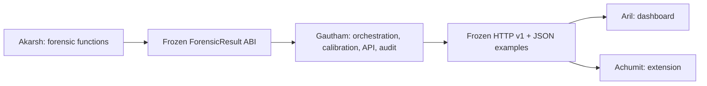

# Four independent modules, one integration owner

Gautham keeps the main system on the current device and owns integration into `main`. Akarsh, Aril and Achumit each use a separate clone and their assigned branch. Work can proceed without teammate-to-teammate coordination because paths, input/output contracts, acceptance tests and escalation files are fixed here.

| Owner | Module | Editable implementation | Starting branch | Work brief |
| --- | --- | --- | --- | --- |
| **Gautham** | Core and integration | API, trust synthesis, schemas, audit/privacy, scenarios, shared tools/contracts, CI and releases | `main` or `gautham/<task>` | [Gautham](people/gautham.md) |
| **Akarsh** | Forensic measurements | `backend/app/forensics/` except shared `common.py` and `AGENTS.md`; `tests/forensics/` | `akarsh/forensics` | [Akarsh](people/akarsh.md) |
| **Aril** | Dashboard | `frontend/` except `AGENTS.md`; includes browser tests | `aril/dashboard` | [Aril](people/aril.md) |
| **Achumit** | Browser extension | `extension/` except `AGENTS.md`; includes DOM fixtures/tests | `achumit/extension` | [Achumit](people/achumit.md) |

Each person can also edit their own brief and `contracts/proposals/<name>/`. All unspecified paths belong to Gautham. The machine-readable authority is [contracts/ownership.json](../../contracts/ownership.json), using the longest matching path. The protected shared files inside module directories are deliberate exceptions.



## Start from the published baseline

In your own clone, from the repository root:

```powershell
git clone https://github.com/Gauthampro7/TrustGuard.git
cd TrustGuard
git fetch origin
git switch --track origin/akarsh/forensics
python -m venv .venv
.\.venv\Scripts\python.exe -m pip install -r backend/requirements.txt -c backend/constraints.txt
```

Replace the branch with `origin/aril/dashboard` or `origin/achumit/extension` as appropriate. If already checked out locally, use `git switch <your-branch>`. Gautham continues in this existing workspace on `main`. Do not share a working directory between parallel branches.

Node 22+ is needed for JavaScript tests. Aril installs the locked browser tooling with `npm ci` and `npx playwright install chromium`. Achumit's extension tests need only Node and have no npm dependencies. Use `.venv\Scripts\python.exe` in place of `python` in the commands below if the environment is not activated.

## Protocol: implement against v1

The [protocol guide](../../contracts/README.md), [HTTP/OpenAPI contract](../../contracts/v1/openapi.json), [extractor ABI](../../contracts/v1/forensics.json) and [synthetic examples](../../contracts/v1/examples/) are the integration seam. They are versioned and Gautham-owned. Existing Python schema import paths and `/api/v1` paths remain stable.

1. Read your brief and select the first uncompleted task in its ordered backlog. [TASKS.md](TASKS.md) defines the separate work queues and acceptance criteria.
2. Work only inside your owned paths. Existing APIs/extractors already work: improve your assigned behavior, not the other modules.
3. Run `python scripts/export_contracts.py --check`. A failure means you changed a shared interface, broke a required result shape, or need the documented pinned environment. Do not regenerate frozen files to hide a failure.
4. If an interface change is necessary, write `contracts/proposals/<name>/<task-id>.md` using the [proposal template](../../contracts/proposals/TEMPLATE.md). Record the exact before/after JSON or signature, compatibility, and required consumer tests. Keep the implementation compatible with v1 until Gautham merges an updated contract. Continue other independent tasks in the meantime.
5. No network scraping, raw biometric persistence, automatic authenticity verdicts or silently invented evidence. Preserve the vector, both ledger polarities, missing-evidence states and independent verification steps.

Additive `metrics` inside a forensic result are allowed if existing required fields and semantics remain intact. New required fields, renamed fields, changed units, changed signatures or altered endpoint semantics require a contract proposal. The frozen examples are synthetic shape/reference fixtures, not accuracy targets: improving a detector may change numeric indices without changing the protocol.

## Checks and handoff

| Owner | Required check command | Additional acceptance |
| --- | --- | --- |
| Gautham | `python scripts/check_module.py all` | `--browser` against the final integrated local API |
| Akarsh | `python scripts/check_module.py forensics` | Document bounded-input latency and new false-positive/abstention regressions |
| Aril | `python scripts/check_module.py dashboard` | `--browser` with API on port 8000; desktop/mobile screenshots and new behavior assertions |
| Achumit | `python scripts/check_module.py extension` | Platform-specific DOM fixtures; distinguish simulated and live browser validation |

To run the local API for a dashboard or extension session:

```powershell
python -m uvicorn backend.app.main:app --host 127.0.0.1 --port 8000
```

Then use a second terminal for checks. Browser tests require an installed Playwright Chromium or `PLAYWRIGHT_CHROMIUM_EXECUTABLE` pointing to an existing binary. The compatibility command `node scripts/test_dashboard.cjs` still works, but Aril edits `frontend/tests/browser-smoke.cjs`.

Before committing:

```powershell
git fetch origin
python scripts/check_ownership.py --base origin/main
python scripts/export_contracts.py --check
git diff --check
```

The ownership command includes committed branch work, uncommitted tracked edits and untracked files. Renames are checked as both deletion and addition. A failed ownership check means the changes must be separated; do not edit another owner's file to finish your branch. A local `--owner <name>` option exists for diagnostics; CI derives the owner from the branch name and reads ownership rules from the integration base.

Commit one task at a time and use `git push -u origin HEAD` to publish your current assigned branch and establish tracking. Open a PR into `main` using the supplied template. A draft PR is the asynchronous status channel; no direct message is needed. Include task ID, changed behavior, exact checks/results, remaining limitations and any proposal path. Update your own brief or `<module>/VALIDATION.md` rather than the shared task table. Do not push directly to `main`, rebase another person's branch or force-push shared work.

Use more granular branches named `akarsh/<task>`, `aril/<task>`, `achumit/<task>` or `gautham/<task>` when preferred. The prefix is how the CI ownership check identifies the work lane; it is a coordination convention, not an authentication mechanism.

## Gautham's integration protocol

Review PRs independently. For ordinary module work, verify owned paths, contract checks and regression results, then merge a passing PR into `main`. For a cross-module proposal, first decide its version/compatibility and publish the shared change plus migration examples and tests from Gautham's branch. Do not make teammates coordinate simultaneous edits to shared files.

After integration, teammates fetch `origin/main` and merge it into their own branch before starting the next task. If that produces a conflict in a shared/Gautham-owned file, retain the integration version and submit a proposal for any missing behavior; do not invent a local fork of the protocol. Resolve only owned-file conflicts yourself. Never discard unrelated changes automatically.

GitHub Actions runs ownership checks on PRs, contract/core tests, Windows forensic checks, extension tests and a real Chromium dashboard run. `CODEOWNERS` currently assigns reviews to the confirmed account `@Gauthampro7`; other people's GitHub usernames are intentionally not guessed. Required-review/required-check branch protection depends on repository settings and is not claimed to be enabled by these files. Gautham remains the integration reviewer even while teammates work independently.

## Directory changes in this baseline

- API handlers now live in `backend/app/api/endpoints/`, with one shared registry/dispatcher in `api/dependencies.py`; `api/routes.py` only composes routers. External routes and operation IDs are unchanged.
- Tests are split into `tests/core/`, `tests/forensics/` and `tests/contracts/`. `python -m pytest tests/` still runs everything.
- The browser acceptance suite belongs to `frontend/tests/`; its old script path is a compatibility wrapper.
- `contracts/v1/` freezes the HTTP and forensic interfaces; `contracts/proposals/` provides disjoint asynchronous change-request paths.
- `package-lock.json` pins browser tooling; `backend/constraints.txt` records the validated API/schema/runtime dependency versions. Only Gautham changes shared dependency files.
